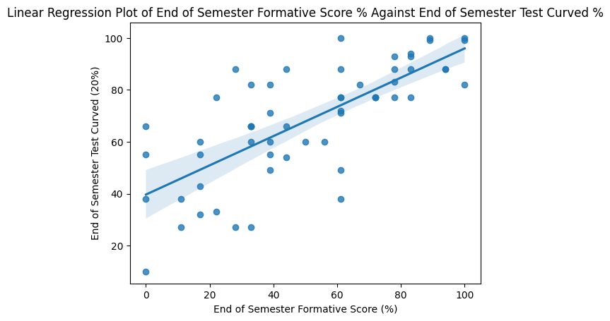
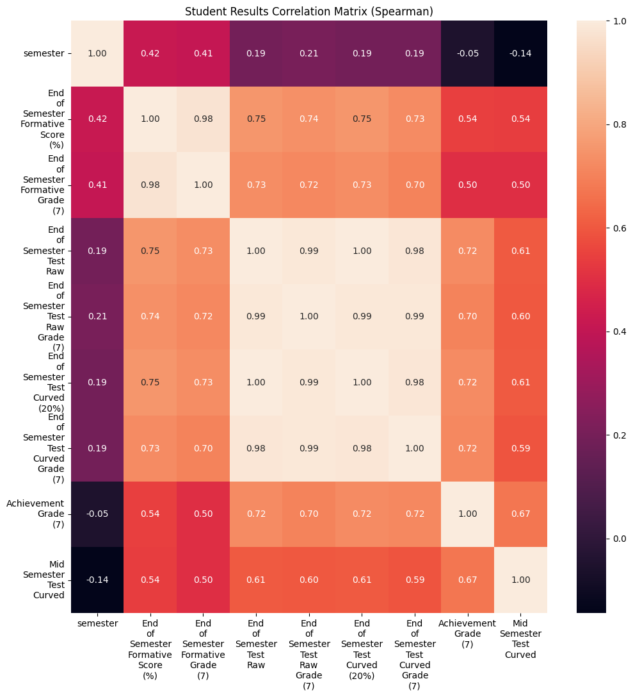
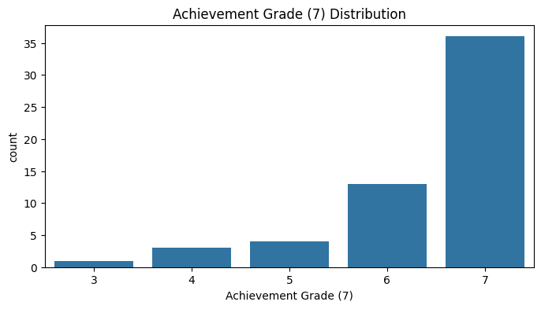

## Student Grade Prediction [[view code]](https://github.com/ejml1/Student-Grade-Analysis/blob/master/data_preparation/data_preparation.ipynb) 

<p align ="center">
    
</p>

<p align="center">
    <a href="#Problem Statement">Problem Statement</a> •
    <a href="#Dataset">Dataset</a> •
    <a href="#Methodology">Methodology</a> •
    <a href="#Future Work">Future Work</a>
</p>

<a id = 'Problem Statement'></a>
## Problem Statement
As a Computer Science teaching team at an international school, we wanted to explore how well the formative score can be used as a prediction for summative score to objectively identify students who required intervention. However through the EDA, it became clear that formative scores alone were not a good indication of a students performance on summative tasks. Therefore, the problem statement evolved into one to predict students final grades throughout various tasks they did throughout the semester. The purpose of this was to find objective measures for intervention as opposed to purely relying on a teacher's intuition. If successful a model could also be used as part of a wider system as described below:

> We wanted to build a website that has a live feed of student progress throughout the semester. Over the course of a semester, students complete several summative assessments that contribute to their final grade (out of 7). Every time they complete an assignment, we want a progress bar to fill closer to the 7-figure. We also want to have another progress bar that shows their predicted grade (and the confidence level of this predicted grade). This will be shown after they have successfully completed a few assignments and done a few in-class tests. Moreover, we want to show a trend of how their predicted grades change over time after completing assignments.

<a id = 'Dataset'></a>
## Dataset
The original dataset is pulled from multiple classes within a single year level from an international school. This data was stored in 5 spreadsheets and combined into one dataset. 3 of the spreadsheets contain formative assessment information from a class and the other 2 contain summative information for all students in a particular semester. As the original dataset contains information about students, it has not been provided in this repository and any information about the students have been anonymised as per school policy. However, the code that transformed the spreadsheets into a single dataset can be found under [scripts/data_prep.py](https://github.com/ejml1/Student-Grade-Analysis/blob/master/scripts/data_prep.py)

The transformed dataset is described below: 
- `student_id`: Anonymised ID given to a student
- `Mid Semester Test Raw`: The % grade given to a student during their summative mid semester test
- `End of Semester Test Raw`: The % grade given to a student during their summative end of semester test
- `Mid Semester Test Curved`: The % grade given to a student during their summative mid semester test after being curved using the formula: $ \dfrac{10x}{\sqrt{x}} $ Where $ x $ represents  `Mid Semester Test Raw`. This value represents 20% or 30% of `Criterion A`'s calculation depending on if the student is from semester 1 or 2
- `End of Semester Test Curved (20%)`: The % grade given to a student during their summative end of semester test after being curved using the formula: $ \dfrac{10x}{\sqrt{x}} $ Where $ x $ represents `End of Semester Test Raw`. This value represents 20% of `Criterion A`'s calculation
- `Lab Completion (10%)`: The % of labs completed by the student. This value represents 10% of `Criterion A`'s calculation
- `Demo Completion %`: The % of demos completed by the student. This represents 10% or 20% of `Criterion A`'s calculation depending on if the student is from semester 1 or 2
- `Criterion A (60%)`: The sum of `Mid Semester Test Curved`, `End of Semester Test Curved (20%)`, `Lab Completion (10%)`, and `Demo Completion %`
- `Criterion A (100%)`: Scaled value of `Criterion A (60%)` to a 100% scale
- `Criterion A PS Grade (6)`: The final criterion A grade out of 6 given to the student based on `Criterion A (100%)`
- `Criterion B PS Grade (6)`: The final criterion B grade out of 6 given to the student
- `Criterion C PS Grade (12)`: The final criterion C grade out of 12 given to the student
- `Criterion D PS Grade (6)`: The final criterion D grade out of 6 given to the student
- `Overall Grade (30)`: The final grade out of 30 given to the student based on the sum of `Criterion A PS Grade (6)`, `Criterion B PS Grade (6)`, `Criterion C PS Grade (12)`, and `Criterion D PS Grade (6)`
- `Achievement Grade (7)` The final categorical transcript grade out of 7 given to the student based on `Overall Grade (30)`
- `semester`: The number of semesters of Computer Science the student has taken
- `End of Semester Formative Score (18)`: The score the student scored on the end of semester formative out of 18 marks
- `End of Semester Formative Score (%)`: The `End of Semester Formative Score (18)` as a %
- `End of Semester Formative Grade (7)`: The categorical grade out of 7 given to the student for the end of semester formative
- `End of Semester Test Raw Grade (7)`: The categorical grade out of 7 given to the student for the end of semester summative
- `End of Semester Test Curved Grade (7)`: The categorical grade out of 7 given to the student for the end of semester summative after being curved using the formula: $ \dfrac{10x}{\sqrt{x}} $ Where $ x $ represents `End of Semester Test Curved (20%)`

<a id ='Methodology'></a>
## Methodology

### 1. Combine Spreadsheets


As mentioned in the Dataset section, the original 5 spreadsheets contain information about a student. An anonymised version of these spreadsheets can be found in the [data](https://github.com/ejml1/Student-Grade-Analysis/blob/master/data) directory. All the spreadsheets were not in a structured, tabular form and therefore required a sequence of transformations to achieve this. The transformations can be found here: [scripts/data_prep.py](https://github.com/ejml1/Student-Grade-Analysis/blob/master/scripts/data_prep.py)

### 2. Data Exploration

Although there is a general positive correlation with students' end of semester formative score and end of semester test score, it is not a perfect indication on how students perform.


<br>

With the task evolving to see if it was possible to predict students final grades throughout various tasks they did throughout the semester, the correlation matrix shows strong correlation among the variables with achievement grades. However, most of this is trivial as a lot these tasks make up a percentage of the final achievement grade. Moreover, the achievement grade distribution shows that a large majority of students are in the high achieving category, highlighting a problem with usefulness in the dataset if we want to identify struggling students.


<br>


<br>

### 3. Feature Engineering 

Due to student grades being highly dependent on a multitude of factors beyond this dataset, it would be better to group achievement grades into categories if we want to predict more accurately. Below is an example of grouping students into 3 categories, 0 being the lowest and 2 being the highest.

```Python
fe_df = imputed_df.copy()
fe_df.loc[fe_df['Achievement Grade (7)'] <= 4, 'Achievement Grade (7)'] = 0
fe_df.loc[fe_df['Achievement Grade (7)'] == 5, 'Achievement Grade (7)'] = 1
fe_df.loc[fe_df['Achievement Grade (7)'] >= 6, 'Achievement Grade (7)'] = 2
fe_df.rename(columns={'Achievement Grade (7)': 'Satisfactory Level'}, inplace=True)
```

### 4. Modelling

As the dataset is limited in regard to the number of students with lower achievement grades, the modelling section is only used as an example of what could be done in the future as opposed to being useful model that can be deployed. 

```Python
pipeline = Pipeline([
    ('random_over_sampler', RandomOverSampler(random_state=0)),
    ('logistic', LogisticRegression(max_iter=1000, random_state=0))
])
```

One way to increase the number of training samples for the minority class is to use an oversampling method. In this example RandomOverSampler is used but if the dataset contained more samples, a more sophisticated method, such as SMOTE, can be used to generate new synthetic training samples.

<a id = 'Future Work'></a>
## Future Work

For future work to continue, more data needs to be collected. This means continuing the practice of recording student data on the various tasks. Other metrics that do not directly contribute to a student's achievement grade should also be collected to see if these have any effect.